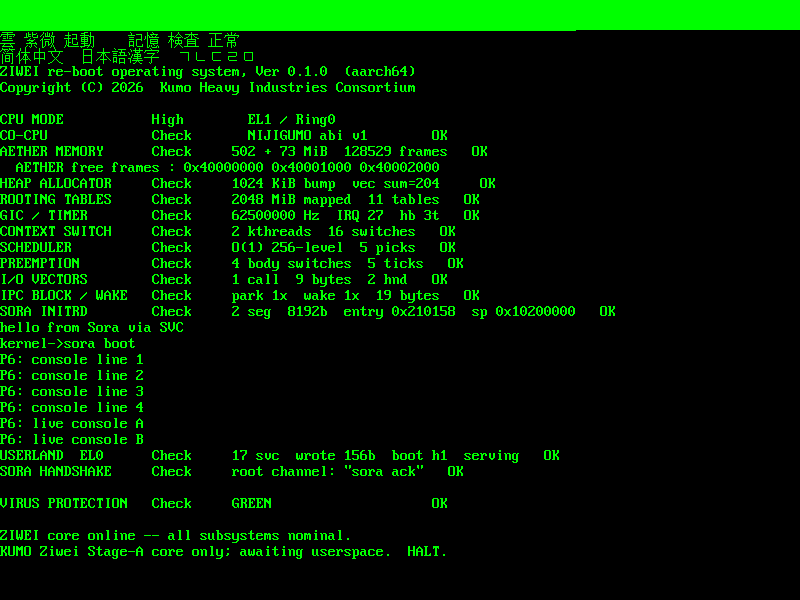

<div align="center">
   

  # KUMO (雲)
  **A Serene, Capability-Based Microkernel in Rust**
</div>

---

**KUMO** is a clean-room, `#![no_std]` Rust rewrite of the [soso](https://github.com/ozkl/soso) monolithic kernel, reimagined as a modern, capability-based microkernel. It strips the privileged kernel down to the irreducible minimum: address spaces, scheduling, IPC, capabilities, and MMU plumbing, while pushing all other services (drivers, filesystems, network, TTY) into fault-isolated, restartable userspace servers.

For clarity, KUMO represents the microkernel core (named MUREX) and its various subsystem microservices that make up the other aspects of the microkernel. KUMO is fundamentally part of a larger "Flying Nimbus" System. Which is intended to function as a UNIX-like environment with the ability to run Linux applications via a custom hybrid Hypervisor that loads the Firecracker VM in tandem with a WSLv1 style linux->native shim for syscalls (similar to Fuchsia's Starnix). Linux applications see a native environment, Nimbus does the hard work and the two ride off in two the sunset together. At least, that's the plan 🤞

I'd like to take a brief moment to thank ozkl (and soso's other contributors). It has provided a lot of inspiration to inform the general functionality of KUMO and it's core components. 

Also, the devs working on:
- [motor-os](https://github.com/moturus/motor-os) 
- Fuchia (Zircon)
- XNU/Mach 
- Redox OS 
- seL4

All of them have given excellent points about pitfalls, implementation, and have truly shaped the internal discourse surrounding this project. KUMO is still obviously in active development, but over time I hope it can become something different but still purposeful in people's lives.

Redox has paved the way for other Rust based systems to exist without having to recreate the entire world of technologies all over again by hand. Writing a Read-Only FAT32 filesystem driver isn't beyond the pale but making something like zfs, butterfs, ext4, by hand is a massive undertaking in a system that's yet to even be built. Thank you to the Redox devs for RedoxFS! So for the time being until we get relibc integration under control (again Thank you guys!) KUMO is still rust only. That being said, we're not even booting into a userland proper yet but slowly that's chaning. Rust uutils/coreutils is on the horizon, but obviously we need Rust's `std` library first -- so again, building *everything* 🤦‍♂️  it's fun until you realize how much work it's going to be. 

My hope is that with some minor adjustments, capability-based seams, and a good HAL that KUMO will be highly portable, stable, performant, and above all resilient in the face of failure.

So far the code boots on real hardware, not just QEMU!

- Thinkpad x13s gen 1, Qualcomm Snapdragon 8cx Gen 3 SoC (arm64)
- Raspberry Pi 5, Broadcom BCM2712 (arm64)
- HP Z4G4, Intel Xeon W2123 (amd64)
- HP Z650, Intel Xeon E5-2620 v0 (amd64)
- Thinkpad x220, Intel i7-2640m (amd64)


## 🏛️ Architecture

*   **Capability Microkernel:** Minimal Trusted Computing Base (TCB). All resources (memory, IPC, interrupts, address spaces) are exposed as Objects. Process authority is defined by unforgeable, capability-typed **Handles**.
*   **Nijigumo (虹雲):** A UEFI-first staged bootloader providing a stable `BootInfo` handoff into MUREX.
*   **MUREX :** The privileged core: scheduler, object tables, handle rights, VMOs/VMARs, IPC, traps, and MMU construction.
*   **Sora (空):** The root server and service-plane supervisor. It receives bootstrap capabilities, hosts early services, and spawns child processes from capability grants.
*   **Hardware Abstraction Layer (HAL):** Clean separation of architecture-specific glue (`kumo-hal-aarch64`, `kumo-hal-x86_64`) from the generic core.

## 🚀 Current Status (P10-b Process Model)

KUMO now boots through UEFI/AAVMF on **aarch64**, exits boot services, enters MUREX at EL1, launches Sora in EL0, and keeps Sora alive as a parked userspace server. The active development spine is the aarch64 process model; x86_64 remains a backend target, but full QEMU parity is still future work.

**Recent execution milestones:**
*   **UEFI handoff:** Nijigumo loads the kernel ELF and initrd from the ESP, builds a validated `BootInfo`, exits boot services, and jumps to MUREX.
*   **Higher-half kernel:** MUREX runs with a TTBR0/TTBR1 split, a higher-half kernel at `0xffff800048000000`, a permanent physmap, and 4 KiB page granules.
*   **Userspace Sora:** Sora is loaded from the initrd as an ELF process, receives bootstrap handles, serves channels through ports, and can park/wake through the scheduler harness.
*   **Capability IPC:** Channels, ports, synchronous call, handle transfer, object rights, and interrupt objects are wired through EL0 `SVC` calls.
*   **Process isolation slice:** P10-b is live. Sora creates an anonymous VMO, writes child code into it, maps it RX into a fresh child address space, builds the child's TTBR0, and runs the child. The live QEMU/AAVMF smoke prints `hello from child as`, `child as run=ok`, and `anon vmo write ok`.
*   **Hardware interrupt lanes:** GICv3 remains the X13s/QEMU path; GICv2/GIC-400 discovery and timer setup have been added for Raspberry Pi 5 parity work.

<div align="center">
  
  <br/>
  <sub>Earlier framebuffer smoke capture: MUREX Stage-A diagnostics, Sora handoff, IPC, scheduler, and timer checks.</sub>
</div>

**Next in the Forge:**
*   **P10-c:** Move child execution off the synchronous `run_child` detour and onto the scheduler/user-thread path, with per-thread TTBR0 save/restore.
*   **VMO maturity:** Extend anonymous mappings beyond executable child-code pages, add real VMO lifetime/reclaim, and split loader segments into distinct VMOs.
*   **Hardware smoke:** Reconfirm the current arm64 path on the ThinkPad X13s; QEMU covers the core process-model path, while metal covers firmware, DTB, GIC, and platform details.

## 💻 Hardware Targets

The genesis hardware target is the **Lenovo ThinkPad X13s Gen 1** (Snapdragon 8cx Gen 3 / SC8280XP). Bare-metal validation is prioritized on this specific arm64 SoC, using GICv3, the ARM generic timer, UEFI, GOP framebuffer discovery, and DTB handoff.

QEMU `virt` (AAVMF) is the fast local smoke path for the aarch64 kernel/userspace spine. Raspberry Pi 5 is a secondary arm64 lane for GICv2/PL011 parity. x86_64 `q35`/OVMF remains part of the architecture goal, but it is not the current critical path.

<div align="center">
   
</div>

## 🛠️ Building and Running

The project is orchestrated via a Cargo `xtask` workspace, eliminating complex Makefiles.

```bash
# Build the QEMU/AAVMF image used for local arm64 smoke testing
cargo xtask image --arch aarch64 --hardware qemu-virt-aarch64

# Build the ThinkPad X13s image
cargo xtask image --arch aarch64 --hardware thinkpad-x13s-gen1

# Run the kernel test suite
cargo test -p kernel

# Run the broader xtask suite
cargo xtask test
```
