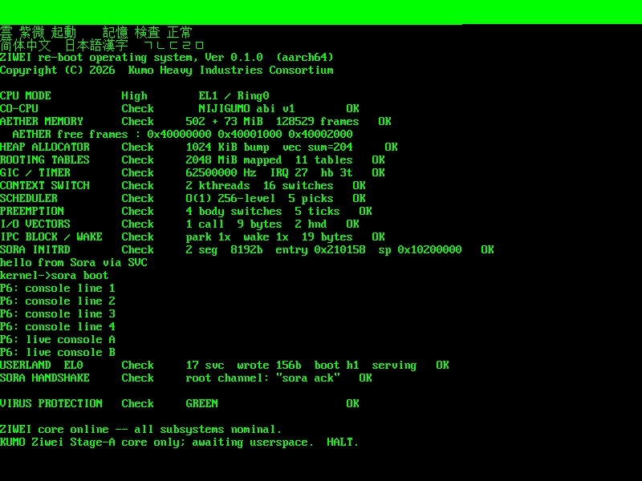

<!--j458-->

<div align="center">
   

  # KUMO (雲)
  **A Serene, Capability-Based Microkernel in Rust**
</div>

---

**KUMO** is a clean-room, `#![no_std]` Rust rewrite of the [soso](https://github.com/ozkl/soso) monolithic kernel, reimagined as a modern, capability-based microkernel. It strips the privileged kernel down to the irreducible minimum: address spaces, scheduling, IPC, capabilities, traps, MMU plumbing, and the small amount of hardware confinement needed to make user-mode drivers honest.

The larger "Flying Nimbus" system is intended to become a UNIX-like environment with native KUMO services, a Rust userspace, persistent storage, graphics, and Linux-application compatibility through a demand-driven persona layer. The project already boots a real EL0 root server and user processes; it is not yet a complete daily-driver OS.

I'd like to take a brief moment to thank ozkl and soso's other contributors. soso provided a lot of inspiration for KUMO's early shape and core components.

Also, the devs working on:
- [motor-os](https://github.com/moturus/motor-os)
- Fuchsia (Zircon)
- XNU/Mach 
- Redox OS 
- seL4

All of them have given excellent points about pitfalls, implementation, and have truly shaped the internal discourse surrounding this project. KUMO is still obviously in active development, but over time I hope it can become something different but still purposeful in people's lives.

Redox has paved the way for other Rust-based systems to exist without recreating every storage and libc component by hand. KUMO's longer-term storage plan leans on RedoxFS, and the libc/`std` plan builds toward a native Rust target instead of pretending the whole userspace stack appears at once.

My hope is that with some minor adjustments, capability-based seams, and a good HAL that KUMO will be highly portable, stable, performant, and above all resilient in the face of failure.

So far the code boots on real hardware, not just QEMU. Hardware bring-up has covered:

- ThinkPad X13s Gen 1, Qualcomm Snapdragon 8cx Gen 3 SoC (arm64)
- Raspberry Pi 5, Broadcom BCM2712 (arm64)
- HP Z4G4, Intel Xeon W2123 (amd64)
- HP Z650, Intel Xeon E5-2620 v0 (amd64)
- ThinkPad X220, Intel i7-2640M (amd64)

The **Orange Pi 5 Plus 4GB** is intentionally not in that metal-boot list yet. Its build target is
complete and host-verified, but its first physical-board boot is the next PLAN VII acceptance gate.

## 🏛️ Architecture

*   **Capability Microkernel:** Minimal Trusted Computing Base (TCB). All resources (memory, IPC, interrupts, address spaces) are exposed as Objects. Process authority is defined by unforgeable, capability-typed **Handles**.
*   **Nijigumo (虹雲):** A UEFI-first staged bootloader providing a stable `BootInfo` handoff into MUREX.
*   **MUREX:** The privileged core: scheduler, object tables, handle rights, VMOs/VMARs, IPC, traps, and MMU construction.
*   **Sora (空):** The root server and service-plane supervisor. It receives bootstrap capabilities, hosts early services, spawns child processes from capability grants, and drives the current service smoke path.
*   **Hardware Abstraction Layer (HAL):** Clean separation of architecture-specific glue (`kumo-hal-aarch64`, `kumo-hal-x86_64`) from the generic core.
*   **Device-VMAR / IOMMU:** DMA-capable devices are confined to `Vmo`s explicitly mapped into their `DeviceCtx`, so user-mode drivers cannot bypass capabilities through raw physical DMA. The object/ABI map, unmap, and fault-delivery lifecycles are host-proven; real SMMU programming remains hardware work.

## 🚀 Current Status

KUMO boots through UEFI/AAVMF on **aarch64**, exits boot services, enters the kernel at EL1, launches Sora in EL0, and exercises a live userspace path through the scheduler, IPC, and serial console. The active hardware lane is moving subsystem bring-up toward the documented and serial-observable **Rockchip RK3588**, while the ThinkPad X13s remains the known-good arm64 baseline. **x86_64 is no longer build-only:** its QEMU first-light path now proves ring 3, private address spaces, interrupt routing, preemption, and per-thread x87/SSE/AVX state ownership.

**Recent execution milestones:**
*   **UEFI handoff:** Nijigumo loads the kernel ELF and initrd from the ESP, builds a validated `BootInfo`, exits boot services, and jumps to MUREX.
*   **Higher-half kernel:** MUREX runs with a TTBR0/TTBR1 split, a higher-half kernel at `0xffff800048000000`, a permanent physmap, and 4 KiB page granules.
*   **Userspace and process model:** Sora is loaded from the initrd as an ELF process, receives bootstrap handles, serves channels through ports, spawns child address spaces, and keeps the root service path alive.
*   **Capability IPC:** Channels, ports, synchronous call, handle transfer, object rights, interrupt objects, timers, and wait paths are wired through EL0 `SVC` calls.
*   **Persona Linux MVP:** The compatibility path can run a static arm64 Linux ELF through the native persona layer; expansion is demand-driven, one missing syscall at a time.
*   **Input and console:** The serial/TTY path supports line editing, history navigation, typed HID keyboard input, and a typed mouse-event forwarding path that currently drains in Sora.
*   **Device-VMAR/IOMMU:** The ABI and kernel object surface for `IoMmu` and `DeviceCtx` covers validated page-aligned map/unmap operations, backend rejection rollback, and stream-fault routing into waitable per-device records. The X13s MMU-500 path is deliberately discovery-only after unsafe enablement was removed; real translation-table/queue programming remains unfinished.
*   **Hardware interrupt lanes:** GICv3 remains the X13s/QEMU path; GICv2/GIC-400 discovery and timer setup support Raspberry Pi 5 parity work.
*   **x86_64 runtime parity:** The QEMU smoke reaches native userspace through private CR3s, routes the canonical tick through the local APIC, exercises I/O APIC delivery, preempts real contexts, and preserves CPUID-gated AVX state with eager XSAVE/XRSTOR (with an FXSAVE fallback).
*   **RK3588 build target:** The Orange Pi 5 Plus BSP profile, hardware aliases, mainline-derived DTB, Nijigumo DTB lookup, and complete staged ESP payload are host-verified. Metal first contact and the DW-APB UART driver are the next gates.
*   **Driver groundwork:** The xHCI lane has host-proven register planning, reset-readiness inspection, and a No-Op command/completion model; block storage has writable private backing and virtio request/ring shapes.

<div align="center">
  
  <br/>
  <sub>Earlier framebuffer smoke capture: MUREX Stage-A diagnostics, Sora handoff, IPC, scheduler, and timer checks.</sub>
</div>

**Next in the Forge:**
*   **Orange Pi R2–R5:** First boot through EDK2-rk3588 or U-Boot EFI, bring up UART2 through the DW-APB/8250 HAL backend, prove GICv3 plus the architectural timer, then reach the interactive Sora serial shell on metal.
*   **M13 Device-VMAR:** Replace model-only map/unmap behavior with real translation tables, invalidation queues, and a live DMA-confinement proof. RK3588's documented MMU600/SMMUv3 is the preferred metal venue; the X13s uses MMU-500/SMMUv2.
*   **USB and storage:** Continue xHCI/DWC3 bring-up on RK3588, then SDMMC/eMMC storage, with serial-visible acceptance markers at each gate.
*   **PLAN IV pillars:** Continue the independent relibc/`std`, RedoxFS/Houtu, and graphics/compositor tracks once their prerequisites are ready.

## 💻 Hardware Targets

KUMO separates a target that **builds** from one that has completed a **metal boot**. The distinction matters for the Orange Pi lane:

| Target | Architecture / SoC | Firmware and early diagnostics | Current evidence |
|---|---|---|---|
| QEMU `virt` | arm64 | AAVMF, PL011, optional ramfb/GOP | Primary automated arm64 boot and userspace smoke |
| ThinkPad X13s Gen 1 | arm64, Qualcomm SC8280XP | UEFI, GOP framebuffer, GICv3 | Known-good metal baseline; HID keyboard and interactive shell path |
| **Orange Pi 5 Plus 4GB** | arm64, full Rockchip RK3588 | EDK2-rk3588 or U-Boot EFI; UART2 at 1.5 Mbaud; GICv3 | **R1 build target complete; R2 metal boot pending** |
| Raspberry Pi 5 | arm64, Broadcom BCM2712 | EDK2, GOP; GIC-400/GICv2 | Metal bring-up observed; full interrupt parity remains a secondary lane |
| Generic UEFI PC | x86_64 | OVMF/UEFI, serial optional | Image builds; Multiboot and UEFI QEMU first-light smokes are green |

### Orange Pi 5 Plus 4GB (Rockchip RK3588)

The reference RK3588 board is the **Xunlong Orange Pi 5 Plus with 4GB RAM**. This is the full RK3588 part (4× Cortex-A76 + 4× Cortex-A55), not an RK3588S board. It was chosen for documented silicon, an accessible 3-pin debug UART, on-board SPI NOR for firmware, removable KUMO media, a mainline device tree, and a path to MMU600/SMMUv3, DWC3/xHCI, SDMMC/eMMC, and later PCIe/NVMe work.

What is implemented now:

- `--hardware orange-pi-5-plus` plus aliases `opi5plus`, `orangepi-5-plus`, `orangepi5plus`, and `rk3588-orangepi-5-plus`.
- A typed `kumo-bsp` board profile: GIC600/GICv3 and a Synopsys DW-APB 16550-class UART at physical address `0xfeb50000`.
- A tracked, mainline-derived `rk3588-orangepi-5-plus.dtb` validated against `xunlong,orangepi-5-plus` and `rockchip,rk3588`.
- Nijigumo searches the staged path `EFI/KUMO/dtb/rockchip/rk3588-orangepi-5-plus.dtb` before falling back to a firmware-provided DTB.
- The image builder emits `BOOTAA64.EFI`, the kernel ELF, initrd, and DTB under `build/images/orange-pi-5-plus/`, plus the adjacent `build/images/kumo-image-plan-orange-pi-5-plus.txt` hardware manifest.

Bring-up requirements and current limits:

- Firmware lives in the board's SPI NOR: use an EDK2-rk3588 build with Orange Pi 5 Plus support, or U-Boot with EFI services. KUMO does not yet build or flash the RK3588 SPL/DDR/BL31/UEFI chain.
- Put the staged KUMO ESP payload on SD/eMMC. The `xtask image` command currently creates the payload tree; it does not write a raw removable-media image.
- UART2 is **not PL011**. It is a DW-APB/8250-family UART with 32-bit registers at stride 4. The boot chain uses **1,500,000 baud**; use a 3.3V USB-UART adapter that supports that rate (FTDI-class is the expected lane).
- PLAN VII R2 (loader banner on physical hardware), R3 (native UART driver), R4 (GIC/timer heartbeat), and R5 (interactive Sora shell) are still pending. GPU/NPU/video, PCIe/NVMe, display/VOP, multicore PSCI, and board power-management drivers are not part of the current acceptance gate.

The ThinkPad X13s is not abandoned: it remains the frozen known-good arm64 baseline. New USB, IOMMU, and storage work moves first on RK3588 because its TRM and serial console make failures observable, then transfers back where the hardware IP overlaps.

<div align="center">
   
</div>

## 🛠️ Building and Running

The project is orchestrated via a Cargo `xtask` workspace, eliminating complex Makefiles.

```bash
# Build the QEMU/AAVMF image used for local arm64 smoke testing
cargo xtask image --arch aarch64 --hardware qemu-virt-aarch64

# Build the ThinkPad X13s image
cargo xtask image --arch aarch64 --hardware thinkpad-x13s-gen1

# Build the Orange Pi 5 Plus 4GB staged ESP payload
cargo xtask image --arch aarch64 --hardware orange-pi-5-plus

# Build the generic x86_64 UEFI image
cargo xtask image --arch x86_64 --hardware generic-uefi-x86_64

# Run the aarch64 QEMU smoke test
cargo xtask qemu-smoke --arch aarch64

# Run the x86_64 Multiboot first-light smoke
cargo xtask x86-smoke

# Run the x86_64 OVMF -> GRUB -> Multiboot2 smoke
cargo xtask x86-uefi-smoke

# Run the core host checks
cargo fmt --check
cargo test -p kumo-abi
cargo test -p kernel

# Run the contributor preflight used by current green slices
./scripts/preflight.sh
```
